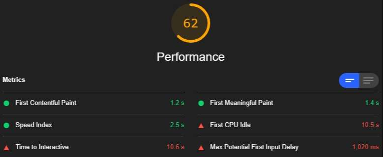
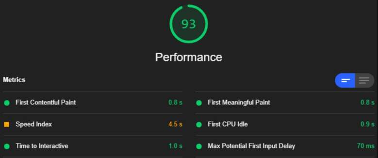

# 🎉 Nuxt Prune HTML

[![npm version][npm-version-src]][npm-version-href]
[![npm downloads][npm-downloads-src]][npm-downloads-href]
[![Circle CI][circle-ci-src]][circle-ci-href]
[![Dependencies][dependencies-src]][dependencies-href]
[![License][license-src]][license-href]
[![Donate][donate-src]][donate-href]

[npm-version-src]: https://img.shields.io/npm/v/@luxdamore/nuxt-prune-html/latest.svg?style=flat-square
[npm-version-href]: https://npmjs.com/package/@luxdamore/nuxt-prune-html

[npm-downloads-src]: https://img.shields.io/npm/dt/@luxdamore/nuxt-prune-html.svg?style=flat-square
[npm-downloads-href]: https://npmjs.com/package/@luxdamore/nuxt-prune-html

[circle-ci-src]: https://img.shields.io/circleci/project/github/LuXDAmore/nuxt-prune-html.svg?style=flat-square
[circle-ci-href]: https://circleci.com/gh/LuXDAmore/nuxt-prune-html

[dependencies-src]: https://img.shields.io/badge/dependencies-up%20to%20date-brightgreen.svg?style=flat-square
[dependencies-href]: https://npmjs.com/package/@luxdamore/nuxt-prune-html

[license-src]: https://img.shields.io/npm/l/@luxdamore/nuxt-prune-html.svg?style=flat-square
[license-href]: https://npmjs.com/package/@luxdamore/nuxt-prune-html

[donate-src]: https://img.shields.io/badge/paypal-donate-black.svg?style=flat-square
[donate-href]: https://www.paypal.com/paypalme2/luxdamore

> Nuxt module to prune html before sending it to the browser (it removes elements matching CSS selector(s)), useful for boosting performance showing a different HTML for bots (removing all the scripts).

## 💘 Motivation

Due to the versatility of Nuxt (and of the SSR in general), a website generated (or served) via node, has everything it needs already injected (in the HTML, ex. styles).
So, usually, for a bot or for a human, the website its almost visually the same.

These library was born to remove the scripts injected in the HTML only if a visitor is a **Bot** or a **Chrome Lighthouse**. This should **speed up** (**blazing fast**) your *nuxt-website* up to a value of **~95** in **performance** during an *Audit* because it [cheats various scenarios](https://web.dev/lighthouse-performance/) (ex. client-only tags could lead in a slower TTI).

> Obviously this could lead in some unexpected behaviors.

**Cons:**

- no SPA navigation;
- no lazy-load for images;
- no client-side-only.

**Pro:**

- some of these features aren't "used by" a Bot or a Lighthouse Audit, so you don't really need it;
- less HTML;
- fast TTI, fast FCP, fast FMP, *fast ecc*.

Inspired by this [rcfs](https://github.com/nuxt/rfcs/issues/22) and this [issue](https://github.com/nuxt/nuxt.js/issues/2822).

___

### Advices

- before setting up the module, try to [Disable JavaScript With Chrome DevTools](https://developers.google.com/web/tools/chrome-devtools/javascript/disable) and navigate;
- this plugin is made for working with Bots and it uses only the `remove()` method of `Cheerio`;
- if you `generate` your site it's not possibile to check the *user-agent*, so i choose to always prune HTML (you can disable this behavior changing `hookGeneratePage` to `false`);
- if you use some `client-only` components, you should prepare a version that is visually the same as the `client-only` and use it in the [placeholder slot](https://nuxtjs.org/api/components-client-only/);
- you can check the website as a GoogleBot, following [this guide](https://developers.google.com/web/tools/chrome-devtools/device-mode/override-user-agent).

### Related things you should know

- It use the [MobileDetect](http://hgoebl.github.io/mobile-detect.js/) library to check if `.is( 'bot' )`, `.match( options.lighthouseUserAgent )` or `.match( options.matchUserAgent )`;
- Nuxt [hooks](https://nuxtjs.org/api/configuration-hooks/), so the plugin has access to `req.headers[ 'user-agent' ]` only if the project is **running as a server** (ex. `nuxt start`);
- [Cheerio](https://github.com/cheeriojs/cheerio).

___

#### 💡 Lighthouse



___

## Setup

1. Add `@luxdamore/nuxt-prune-html` dependency to your project;
2. Add `@luxdamore/nuxt-prune-html` in the `modules` section of your `nuxt.config.js`;

```bash

    yarn add @luxdamore/nuxt-prune-html # or npm install --save @luxdamore/nuxt-prune-html

```

## Configuration

**_N.B. : Shallow merge, not deep merge._**

```js

    // nuxt.config.js
    export default {

        // Module installation
        modules: [ '@luxdamore/nuxt-prune-html' ],

        // Module config
        pruneHtml: {
            hideErrorsInConsole: false,
            hideGenericMessagesInConsole: false, // Disabled in production
            enabled: false, // Disabled in dev-mode due to the hot reload (is client-side)
            // Css selectors to prune
            selectors: [
                'link[rel="preload"][as="script"]',
                'script:not([type="application/ld+json"])',
            ],
            // It use Cheerio under the hood, so this is the config passed in the cheerio.load() method
            cheerio: {
                xmlMode: false,
            },
            ignoreBotOrLighthouse: false, // Remove selectors in any case, not depending on Bot or Lighthouse
            isBot: true, // Remove selectors if is a bot
            isLighthouse: true, // Remove selectors if match the Lighthouse UserAgent
            matchUserAgent: null, // Remove selectors if this userAgent is matched
            hookRenderRoute: true, // Activate in `hook:render:route`
            hookGeneratePage: true, // Activate in `hook:generate:page`
            lighthouseUserAgent: 'lighthouse', // Value of the Lighthouse UserAgent
        },

    };

```

___

## Development

1. Clone this repository;
2. Install dependencies using `yarn install` or `npm install`;
3. Start development server using `yarn dev` or `npm run dev`.

## 🐞 Issues

Please make sure to read the [Issue Reporting Checklist](/.github/ISSUE_TEMPLATE/bug_report.md) before opening an issue. Issues not conforming to the guidelines may be closed immediately.

## 👥 Contribution

Please make sure to read the [Contributing Guide](/.github/ISSUE_TEMPLATE/feature_request.md) before making a pull request.

## 📖 Changelog

Details changes for each release are documented in the [**release notes**](./CHANGELOG.md).

### 📃 License

[MIT License](./LICENSE) // Copyright (©) 2019-present [Luca Iaconelli](https://lucaiaconelli.it)

#### 💸 Are you feeling generous today?  :)

Do you want to share a beer? We can be good friends.. __[Paypal](https://www.paypal.me/luxdamore) // [Patreon](https://www.patreon.com/luxdamore)__

> _It's always a good day to be magnanimous - cit_

#### 💼 Hire me

[](https://lucaiaconelli.it)

[](https://ko-fi.com/luxdamore)

___

##### ✔ TODO

> Just asking myself if i should do more.

- Add more tests.
